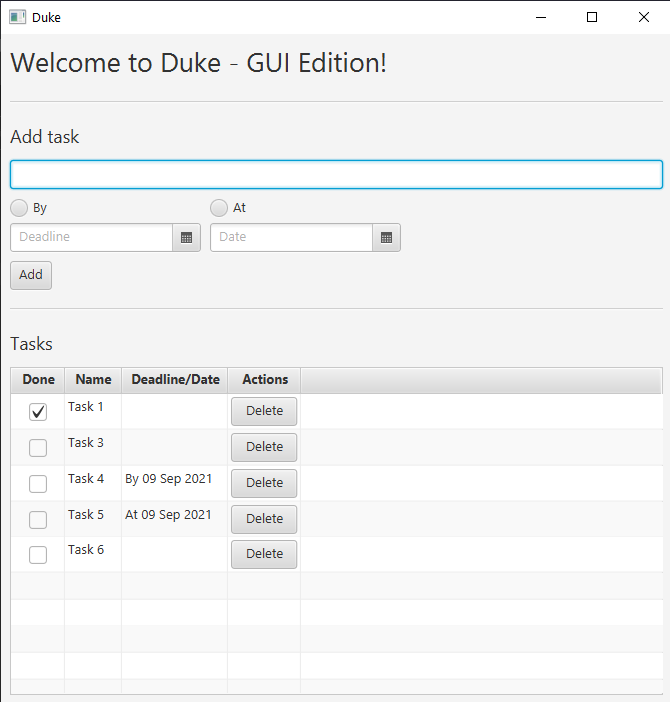

# User Guide



Duke is an application that allows easy task creation and management.

## Features

### Intuitive GUI

An intuitive user interface allows Duke GUI to be used easily.

### Easy-to-use CLI

Duke can also be launched in CLI mode, which allows quick adding of tasks in via a command line interface.

### Dates

Date information can be added to tasks, making it easy to keep track of deadlines and events.

## Usage

### Saving tasks

All tasks are automatically saved to `duke-task-list.txt` in the same folder as the `duke.jar` file.

### GUI mode

1. Double-click to run the IP in CLI mode

Alternatively, run

```
java -jar duke.jar
```

#### Add a task

1. Enter a title
2. Choose a deadline or date with the date picker fields (optional)
3. Click "Add"

#### Remove a task

1. Locate the row corresponding to the task in the table view
2. Click "Remove" button in the "Actions" column

#### Mark task as done/undone

1. Check the checkbox beside a task to mark it as done
2. Changes will be saved to save file automatically


### CLI mode

```
java -jar duke.jar cli
```

#### `help` - Show help

Shows the help command, which lists all the other commands.

Example of usage:

`help`

Expected outcome:

```
ALL COMMANDS:
add         Add a task (with optionally a deadline or a date)
bye         Exit Duke
delete      Delete a task
done        Mark the task as done
find        Find a task
help        Display all commands, or detailed info of given command
list        List all tasks
```

#### Command-specific help

`help add` shows usage information for the `add` command

The list of commands are shown above.
